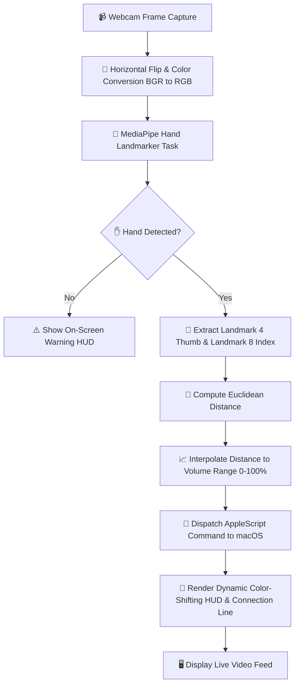

# ✋ Hands Volume Control 🔊

An interactive, real-time computer vision application that lets you control your macOS system volume using intuitive hand gestures! By tracking your hand landmarks in real time via a webcam, this project calculates the distance between your thumb and index finger to dynamically adjust the macOS master volume.

---

## 🏗️ Architecture & Flow Scheme

The pipeline processes webcam frames sequentially using **OpenCV** and **MediaPipe's Hand Landmarker API** before interfacing with the macOS system layer using native AppleScript.



---

## 📂 Directory Structure

Here is a clean layout of the project workspace:

```bash
Hands Volume Control/
├── 📄 README.md                  # 🚀 Project documentation and guides
├── 📄 main.py                    # 🎯 Main execution loop and orchestration
├── 📄 utils.py                   # 🛠️ System volume utilities and HUD rendering
├── 📄 requirements.txt           # 📦 Required Python package dependencies
└── 📁 Hand_Tracking_Model/       # 🧠 Machine Learning hand tracking components
    ├── 📄 utils.py               # 📐 handDetector class wrapper for MediaPipe
    └── 💾 hand_landmarker.task   # 🦾 Pre-trained MediaPipe hand landmark model
```

---

## 📄 File Details

Below is an overview of the key components in this repository:

* 🚀 [main.py](file:///Users/wess/Desktop/computer%20vision/Hands%20Volume%20Control%20/main.py): The main driver script that initializes webcam capture, triggers the frame preprocessing, runs the hand landmarker inference, computes gesture metrics, updates macOS volume, and displays the final annotated output window.
* 🛠️ [utils.py](file:///Users/wess/Desktop/computer%20vision/Hands%20Volume%20Control%20/utils.py): Holds utility functions such as [get_fps](file:///Users/wess/Desktop/computer%20vision/Hands%20Volume%20Control%20/utils.py#L11) for real-time FPS calculation, [get_macos_volume](file:///Users/wess/Desktop/computer%20vision/Hands%20Volume%20Control%20/utils.py#L27) / [set_macos_volume](file:///Users/wess/Desktop/computer%20vision/Hands%20Volume%20Control%20/utils.py#L36) for native macOS system volume control via `osascript`, and [HUD](file:///Users/wess/Desktop/computer%20vision/Hands%20Volume%20Control%20/utils.py#L42) to draw the color-shifting HUD ring.
* 📐 [Hand_Tracking_Model/utils.py](file:///Users/wess/Desktop/computer%20vision/Hands%20Volume%20Control%20/Hand_Tracking_Model/utils.py): Contains the [handDetector](file:///Users/wess/Desktop/computer%20vision/Hands%20Volume%20Control%20/Hand_Tracking_Model/utils.py#L20) class which abstracts MediaPipe's BaseOptions and HandLandmarker API configuration (running in video mode) to detect, parse, and draw hand landmarks.
* 🦾 [Hand_Tracking_Model/hand_landmarker.task](file:///Users/wess/Desktop/computer%20vision/Hands%20Volume%20Control%20/Hand_Tracking_Model/hand_landmarker.task): The binary bundle model compiled by MediaPipe to locate 21 3D hand landmark coordinates.
* 📦 [requirements.txt](file:///Users/wess/Desktop/computer%20vision/Hands%20Volume%20Control%20/requirements.txt): Lists the Python requirements (`mediapipe` and `opencv-python`).

---

## 🧮 How It Works (Core Logic)

The project leverages coordinate geometry and mapping algorithms to achieve smooth volume control:

### 1. Landmarker Tracking
MediaPipe tracks $21$ hand landmark coordinates in a normalized coordinate space. The app focuses on:
* **Thumb Tip** ($\text{Landmark } 4$)
* **Index Finger Tip** ($\text{Landmark } 8$)

### 2. Distance Calculation
We compute the Euclidean distance $d$ in pixel space between these two points:
$$d = \sqrt{(x_2 - x_1)^2 + (y_2 - y_1)^2}$$

### 3. Dynamic Range Interpolation
The pixel distance $d$ is mapped to a volume level percentage $V \in [0, 100]$ using linear interpolation:
* If $d < 50$, then $V = 0\%$ (Muted)
* If $d > 300$, then $V = 100\%$ (Maximum)
* Otherwise, $V = \text{interp}(d, [50, 300], [0, 100])$

### 4. Color-Shifting HUD
The HUD circle's color shifts smoothly in BGR format from Green (representing low volume) to Blue (representing high volume) via:
$$\text{Color} = (0, 255 - 2.55 \times V, 2.55 \times V)$$

---

## 🛠️ Setup & Requirements

### Prerequisites
* **macOS** (since native volume controls use AppleScript `osascript` commands)
* **Python 3.8+**
* Webcam access permissions for your terminal or IDE

### Step-by-Step Installation

1. **Clone & Navigate to the Project Directory**:
   ```bash
   cd "Hands Volume Control"
   ```

2. **Create and Activate a Virtual Environment**:
   ```bash
   python3 -m venv .venv
   source .venv/bin/activate
   ```

3. **Install Package Dependencies**:
   ```bash
   pip install --upgrade pip
   pip install -r requirements.txt
   ```

---

## 🎮 Controls & Usage

To start the real-time hand-tracking volume controller:

```bash
python main.py
```

### Gesture Interactions:
* 🟢 **Pinch Close** ($d < 50$ px): Draws a **green** line and sets macOS volume to **0%** (Muted).
* 🔴 **Normal Range** ($50 \le d \le 300$ px): Draws a **red** line and adjusts volume continuously between **0% and 100%**.
* 🔵 **Spread Wide** ($d > 300$ px): Draws a **blue** line and sets macOS volume to **100%**.

### Program Controls:
* Press `SPACE` in the live video preview window to safely release the camera and close the application.
